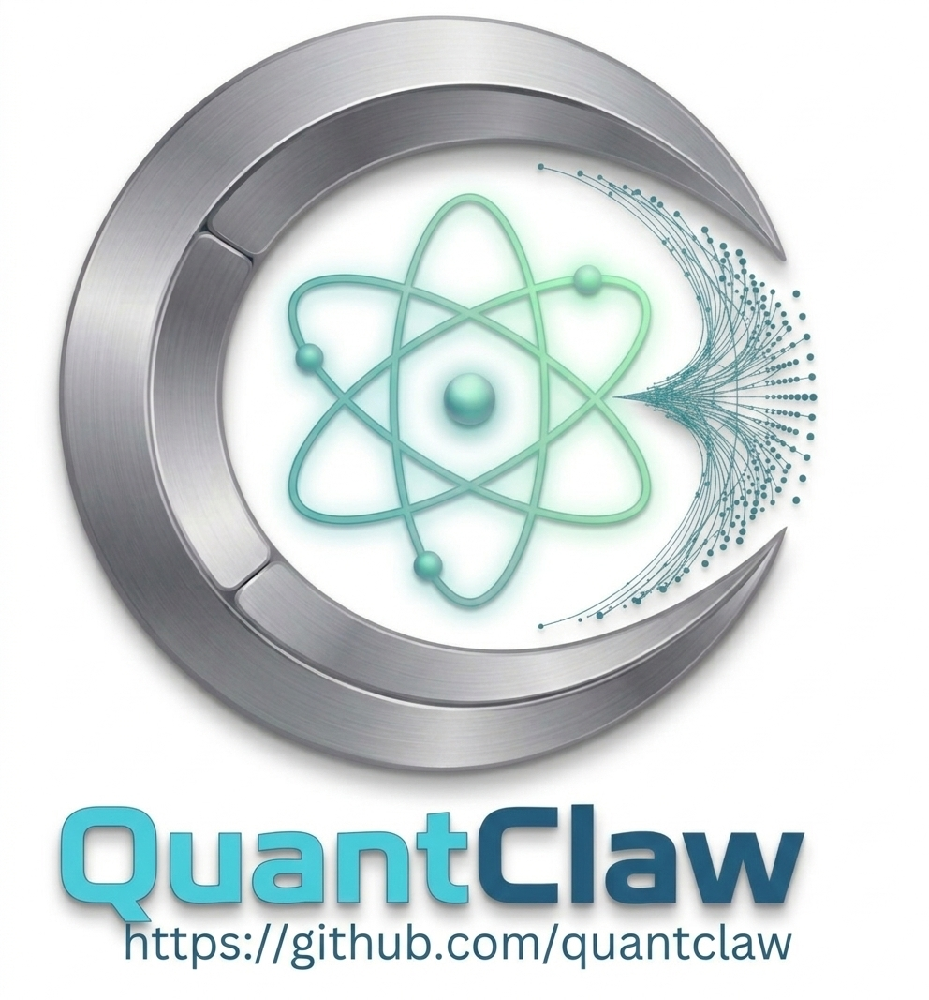

<p align="center">
  
</p>

<h1 align="center">RavBot</h1>

<p align="center">
  <strong>C++17 高性能私人 AI 助手</strong>
</p>

<p align="center">
  <a href="LICENSE"></a>
  <a href="https://github.com/RavBot/RavBot/actions/workflows/github-actions.yml"></a>
  
  
  
  <a href="https://github.com/openclaw/openclaw"></a>
</p>

<p align="center">
  <a href="README.md">English</a>
</p>

---

RavBot 是 [OpenClaw](https://github.com/openclaw/openclaw) 生态的 C++ 原生实现，专注于性能和低内存占用，同时完全兼容 OpenClaw 的工作空间文件、技能系统和 WebSocket RPC 协议。

## 特性

- **原生性能**：C++17 编译为原生二进制，无解释器开销，无 GC 停顿
- **内存高效**：内存占用极低，适合资源受限的服务器环境
- **OpenClaw 兼容**：兼容 OpenClaw 工作空间文件、技能和配置格式
- **双协议接入**：WebSocket RPC 网关 + HTTP REST API
- **多模型支持**：OpenAI 兼容接口和 Anthropic API，通过 `provider/model` 前缀路由
- **模型故障转移**：多 API Key 轮换 + 指数退避冷却 + 自动模型回退链
- **命令队列**：per-session 串行保证，支持 collect/followup/steer/interrupt 模式和全局并发控制
- **上下文治理**：自动压缩、工具结果裁剪、BM25 记忆搜索
- **频道适配器**：接入 Discord、Telegram 或自定义机器人
- **会话持久化**：完整对话历史（含工具调用上下文）以 JSONL 格式保存
- **技能系统**：兼容 OpenClaw SKILL.md 格式（同时支持 OpenClaw 和 RavBot 两种清单格式）
- **插件生态**：通过 Node.js Sidecar 完全兼容 OpenClaw 插件——工具、钩子、服务、Provider、命令、HTTP 路由、网关方法
- **MCP 支持**：Model Context Protocol，接入外部工具服务器
- **文件系统优先**：无数据库依赖，所有数据存储在工作空间目录

## 📖 文档

完整文档请访问：**[https://ravbot.github.io/](https://ravbot.github.io/)**

包含：
- [快速开始指南](https://ravbot.github.io/guide/getting-started)
- [多平台安装说明](https://ravbot.github.io/guide/installation)
- [架构文档](https://ravbot.github.io/guide/architecture)
- [插件开发指南](https://ravbot.github.io/guide/plugins)
- [CLI 参考](https://ravbot.github.io/guide/cli-reference)

## 快速开始

### 1. 编译 RavBot

```bash
git clone https://github.com/RavBot/RavBot.git
cd RavBot
mkdir build && cd build
cmake ..
cmake --build . --parallel

# 运行测试
./ravbot_tests

# 安装（可选）
sudo cmake --install .
```

### 2. 运行 Onboarding 向导

```bash
# 交互式设置向导（推荐）
ravbot onboard

# 或自动安装后台服务
ravbot onboard --install-daemon

# 或快速设置（无提示）
ravbot onboard --quick
```

Onboarding 向导会引导你完成：
- 配置设置（网关端口、AI 模型等）
- 工作空间创建（SOUL.md、技能目录等）
- 可选安装后台服务（Linux 使用 `systemd --user`，macOS 使用 `launchd`）
- 技能初始化
- 设置验证

### 3. 启动网关

```bash
# 如果已安装为服务
ravbot gateway start

# 或前台运行
ravbot gateway
```

### 4. 打开仪表板

```bash
# 打包ui
./scripts/build_ui.sh

# 打开仪表板
ravbot dashboard
```

这会在 `http://127.0.0.1:18801` 打开 Web UI

## 仪表板认证

仪表板需要输入 token 才能访问。Token 在配置文件中设置：

```json
{
  "gateway": {
    "auth": {
      "mode": "token",
      "token": "YOUR_SECRET_TOKEN"
    }
  }
}
```

**首次访问：**
1. 在浏览器中打开 `http://127.0.0.1:18801`
2. 输入你在 `~/.ravbot/ravbot.json` 中配置的 token
3. Token 会保存在浏览器 localStorage 中，后续访问无需重复输入

**关闭认证**（生产环境不推荐）：
```json
{
  "gateway": {
    "auth": {
      "mode": "none"
    }
  }
}
```

**修改 Token：**
1. 编辑 `~/.ravbot/ravbot.json`，修改 `gateway.auth.token` 的值
2. 运行 `ravbot config reload`（或重启网关）
3. 清除浏览器中 `127.0.0.1:18801` 的 localStorage，然后输入新 token

## 端口配置

RavBot 使用专属端口范围以避免与 OpenClaw 和其他服务冲突：

| 服务 | 端口 | 用途 |
|------|------|------|
| WebSocket RPC 网关 | `18800` | 主网关，客户端连接入口 |
| HTTP REST API / 仪表板 | `18801` | 控制面板和 REST API |
| Sidecar IPC (TCP loopback) | `18802-18899` | Node.js Sidecar 进程通信 |

**注意**：RavBot 使用端口 `18800-18801`（不同于 OpenClaw 的 `18789-18790`），允许两者同时运行。

要使用自定义端口，编辑 `~/.ravbot/ravbot.json`：

```json
{
  "gateway": {
    "port": 18800,
    "controlUi": {
      "port": 18801
    }
  }
}
```

## 架构

```
~/.ravbot/
├── ravbot.json              # 配置文件（OpenClaw 格式）
├── skills/                     # 已安装的技能（OpenClaw 兼容）
│   └── weather/
│       └── SKILL.md
└── agents/main/
    ├── workspace/
    │   ├── SOUL.md             # 助手身份与价值观
    │   ├── IDENTITY.md         # 能力自述
    │   ├── MEMORY.md           # 长期记忆
    │   ├── SKILL.md            # 可用技能声明
    │   ├── HEARTBEAT.md        # 定时状态 / Cron 日志
    │   ├── USER.md             # 用户画像与偏好
    │   ├── AGENTS.md           # 已知 Agent 列表
    │   └── TOOLS.md            # 工具使用指引
    └── sessions/
        ├── sessions.json       # 会话索引
        └── <session-id>.jsonl  # 单会话记录
```

## 配置

配置文件路径：`~/.ravbot/ravbot.json`

```json
{
  "system": {
    "logLevel": "info"
  },
  "llm": {
    "model": "openai/qwen-max",
    "maxIterations": 15,
    "temperature": 0.7,
    "maxTokens": 4096
  },
  "providers": {
    "openai": {
      "apiKey": "YOUR_OPENAI_API_KEY",
      "baseUrl": "https://api.openai.com/v1",
      "timeout": 30
    },
    "anthropic": {
      "apiKey": "YOUR_ANTHROPIC_API_KEY",
      "baseUrl": "https://api.anthropic.com",
      "timeout": 30
    }
  },
  "gateway": {
    "port": 18800,
    "bind": "loopback",
    "auth": { "mode": "token", "token": "YOUR_SECRET_TOKEN" },
    "controlUi": { "enabled": true, "port": 18801 }
  },
  "channels": {
    "discord": { "enabled": false, "token": "YOUR_DISCORD_BOT_TOKEN", "allowedIds": [] },
    "telegram": { "enabled": false, "token": "YOUR_TELEGRAM_BOT_TOKEN", "allowedIds": [] }
  },
  "tools": {
    "allow": ["group:fs", "group:runtime"],
    "deny": []
  },
  "security": {
    "sandbox": {
      "enabled": true,
      "allowedPaths": ["~/.ravbot/agents/main/workspace"],
      "deniedPaths": ["/etc", "/sys", "/proc"]
    }
  },
  "mcp": {
    "servers": []
  }
}
```

`model` 字段使用 `provider/model-name` 前缀路由。不带前缀时默认走 `openai`。任何兼容 OpenAI Chat Completion 格式的 API 都可以通过修改 `baseUrl` 接入（通义千问、DeepSeek、本地 Ollama 等）。

### OpenAI Codex OAuth 登录

RavBot 还支持通过独立的 `openai-codex` provider 走浏览器 OAuth 登录 OpenAI 账号，这样可以在不设置 `OPENAI_API_KEY` 的情况下使用 ChatGPT / Codex：

```bash
ravbot models auth login --provider openai-codex
ravbot models auth status --provider openai-codex
ravbot models auth logout --provider openai-codex
```

OAuth 凭证会保存在 `~/.ravbot/auth/openai-codex.json`，并在可用时自动刷新。`status` 会显示本地是否已有缓存凭证，以及当前 access token 是否仍然有效或可刷新。`logout` 只会清除本地缓存凭证，不会把你当前配置的模型自动切回非 `openai-codex/...` 路径。Auth store 写盘采用原子替换，保存失败时不会把已有登录态一起删掉。要使用这条 OAuth 路径，把模型配置成 `openai-codex/...`，例如：

```json
{
  "llm": {
    "model": "openai-codex/gpt-5"
  },
  "providers": {
    "openai-codex": {
      "baseUrl": "https://chatgpt.com/backend-api",
      "timeout": 30
    }
  }
}
```

如果你想继续使用标准 OpenAI API key 路径，仍然使用 `openai` provider + `apiKey` / `apiKeyEnv` 即可。

### GitHub Copilot 登录

RavBot 也支持通过独立的 `github-copilot` provider 接入 GitHub Copilot，登录方式采用 GitHub device flow：

```bash
ravbot models auth login --provider github-copilot
ravbot models auth status --provider github-copilot
ravbot models auth logout --provider github-copilot

# 快捷别名
ravbot models auth login-github-copilot
```

长期 GitHub 凭证会保存在 `~/.ravbot/auth/github-copilot.json`，短期 Copilot API token 会缓存在 `~/.ravbot/auth/github-copilot.token-cache.json`。`status` 会显示本地是否已有缓存凭证，以及当前 access token 是否仍然有效或可刷新。`logout` 只会清除本地缓存凭证，不会把你当前配置的模型自动切回非 `github-copilot/...` 路径。Auth store 写盘采用原子替换，保存失败时不会把已有登录态一起删掉。运行时会优先读取 `COPILOT_GITHUB_TOKEN`，然后是 `GH_TOKEN`、`GITHUB_TOKEN`，如果都没有再回退到本地 auth store。

要使用这条路径，把模型配置成 `github-copilot/...`，例如：

```json
{
  "llm": {
    "model": "github-copilot/gpt-4o"
  }
}
```

### 日志保存策略

RavBot 在每次网关启动时自动清理过期日志，防止磁盘被撑爆。

| 配置项 | 键名 | 默认值 | 说明 |
|--------|------|--------|------|
| 保存天数 | `system.logRetentionDays` | `7` | 删除超过 N 天的 `.log` 文件。设为 `0` 表示永久保留。 |
| 总容量上限 | `system.logMaxSizeMb` | `50` | 日志文件总占用上限（MiB），均分为 5 个轮转文件（每个约 10 MiB）。 |

日志保存在 `~/.ravbot/logs/`。主日志（`ravbot.log`）由 spdlog 按大小自动轮转；网关服务日志（`gateway.log`，通过 Linux/macOS 的平台服务管理器写入）会在每次启动时按时间清理。

完整配置示例见 `config.example.json`。

### 依赖

**系统包（需手动安装）**：
- C++17 编译器（GCC 7+ 或 Clang 5+）
- spdlog — 日志
- nlohmann/json — JSON 库
- libcurl — HTTP 客户端
- OpenSSL — TLS/SSL

**CMake 自动拉取**：
- IXWebSocket 11.4.5 — WebSocket 服务端/客户端
- cpp-httplib 0.18.3 — HTTP 服务端
- Google Test 1.14.0 — 测试框架

### Ubuntu / Debian 一键安装依赖

```bash
sudo apt install build-essential cmake libssl-dev \
  libcurl4-openssl-dev nlohmann-json3-dev libspdlog-dev zlib1g-dev
```

## 使用

### Onboarding 向导

最简单的入门方式是交互式 Onboarding 向导：

```bash
# 运行完整向导
ravbot onboard

# 自动安装后台服务
ravbot onboard --install-daemon

# 快速设置（无交互）
ravbot onboard --quick
```

向导会创建：
- 配置文件（`~/.ravbot/ravbot.json`）
- 工作空间目录（`~/.ravbot/agents/main/workspace/`）
- SOUL.md（助手身份文件）
- 可选的每用户后台服务定义（Linux: `systemd --user`，macOS: `launchd`）

### 网关（后台服务）

```bash
# 前台运行
ravbot gateway

# 安装后台服务定义（systemd --user / launchd）
ravbot gateway install

# 卸载后台服务定义
ravbot gateway uninstall

# 启动 / 停止 / 重启后台服务
ravbot gateway start
ravbot gateway stop
ravbot gateway restart

# 查看状态
ravbot gateway status

# 直接调用任意 RPC 方法
ravbot gateway call gateway.health
```

### 与 AI 对话

```bash
# 发送消息
ravbot agent "你好，介绍一下你自己"

# 指定会话
ravbot agent --session my:session "今天天气怎么样？"
```

### 会话管理

```bash
ravbot sessions list
ravbot sessions history <session-key>
ravbot sessions delete <session-key>
ravbot sessions reset <session-key>
```

### 配置管理

```bash
ravbot config get                    # 查看完整配置
ravbot config get llm.model          # 查看指定配置项（点路径）
ravbot config set llm.model "anthropic/claude-sonnet-4-6"    # 修改配置值
ravbot config unset llm.temperature                          # 删除某个配置键
ravbot config reload                 # 热重载配置（无需重启网关）
```

### 技能管理

```bash
ravbot skills list              # 列出已加载技能
ravbot skills install <name>    # 安装技能依赖
```

### 记忆搜索

```bash
ravbot memory search "<查询内容>"  # 在工作空间记忆文件中进行 BM25 搜索
ravbot memory status              # 显示记忆索引统计信息
```

### 定时任务

```bash
ravbot cron list                            # 列出定时任务
ravbot cron add <name> <schedule> <task>    # 添加定时任务（cron 表达式）
ravbot cron remove <id>                     # 按 ID 删除任务
```

### 其他命令

```bash
ravbot health          # 健康检查
ravbot logs            # 查看网关日志（默认最后 50 行）
ravbot logs -n 100     # 查看最后 100 行
ravbot logs -f         # 实时跟踪日志（Linux/macOS 支持；Windows 请改用：ravbot logs -n 50）
ravbot logs -n 20 -f   # 从最后 20 行开始实时跟踪（Linux/macOS 支持；Windows 请改用：ravbot logs -n 20）
ravbot doctor          # 诊断检查
ravbot dashboard       # 在浏览器中打开 Web UI
```

### 对话内消息指令

与 AI 对话时，发送以斜杠开头的消息即可控制当前会话：

| 指令 | 效果 |
|------|------|
| `/new` | 开启新会话 |
| `/reset` | 清空当前会话历史 |
| `/compact` | 手动触发上下文压缩 |
| `/status` | 显示当前会话和队列状态 |
| `/commands` | 列出所有可用斜杠指令 |
| `/help` | 显示帮助信息 |

## 技能系统

技能通过将上下文指令和工具注入系统提示来扩展 Agent 的能力。每个技能是一个包含 `SKILL.md` 文件的目录。

### 内置技能

| 技能 | 描述 | 始终激活 |
|------|------|----------|
| 🔍 `search` | 网页搜索，使用 `web_search` 工具（Tavily 优先，DuckDuckGo 兜底） | 是 |
| 🌦️ `weather` | 通过 wttr.in 查询当前天气 | 是 |
| 🐙 `github` | 使用 `gh` CLI 与 GitHub 交互 | 否（需要 `gh`）|
| 🏥 `healthcheck` | 系统健康审计与诊断 | 是 |
| 🎨 `skill-creator` | 新技能创建向导 | 是 |

### 创建自定义技能

将技能目录放在 `~/.ravbot/skills/`（全局）或工作空间目录下：

```yaml
# skills/my-skill/SKILL.md
---
name: my-skill
emoji: "🔧"
description: 技能描述
requires:
  bins:
    - required-binary    # 技能激活所需的二进制工具
  env:
    - REQUIRED_ENV_VAR
always: false            # true = 始终注入；false = 按需激活
metadata:
  openclaw:
    install:
      apt: package-name  # 通过 `skills install` 自动安装
      node: npm-package
---

此处的 Markdown 说明会在技能激活时注入到 Agent 的系统提示中。
```

技能格式与 OpenClaw SKILL.md 格式完全兼容。

## 频道适配器

RavBot 通过频道适配器接入外部消息平台。适配器是独立的 Node.js 进程，以标准 WebSocket RPC 客户端的方式连接网关。

**内置适配器**（`src/adapters/` 目录）：

| 适配器    | 依赖库      | 状态 |
|----------|-------------|------|
| Discord  | discord.js  | 可用 |
| Telegram | telegraf    | 可用 |

在配置中启用频道：

```json
{
  "channels": {
    "discord": {
      "enabled": true,
      "token": "YOUR_DISCORD_BOT_TOKEN"
    }
  }
}
```

网关启动时会自动拉起已启用的适配器。每个适配器通过 `connect` + `chat.send` RPC 调用接入——和任何 OpenClaw 兼容客户端的接入方式完全一致。

## HTTP REST API

网关运行后，HTTP API 在 `http://localhost:18801` 可用：

```bash
# 健康检查
curl http://localhost:18801/api/health

# 网关状态
curl http://localhost:18801/api/status

# 发送消息（非流式）
curl -X POST http://localhost:18801/api/agent/request \
  -H "Content-Type: application/json" \
  -d '{"message": "你好！", "sessionKey": "my:session"}'

# 列出会话
curl http://localhost:18801/api/sessions?limit=10

# 查看会话历史
curl "http://localhost:18801/api/sessions/history?sessionKey=my:session"
```

启用认证时，需添加 `Authorization` 头：
```bash
curl -H "Authorization: Bearer YOUR_TOKEN" http://localhost:18801/api/status
```

### 插件 API 接口

```bash
# 列出已加载插件
curl http://localhost:18801/api/plugins

# 获取插件工具 Schema
curl http://localhost:18801/api/plugins/tools

# 调用插件工具
curl -X POST http://localhost:18801/api/plugins/tools/my-tool \
  -H "Content-Type: application/json" \
  -d '{"arg1": "value"}'

# 列出插件服务 / Provider / 命令
curl http://localhost:18801/api/plugins/services
curl http://localhost:18801/api/plugins/providers
curl http://localhost:18801/api/plugins/commands
```

## WebSocket RPC 协议（OpenClaw 兼容）

网关在端口 18800 暴露 WebSocket RPC 接口：

1. 客户端连接 → 服务端发送 `connect.challenge`（含 nonce）
2. 客户端回复 `connect.hello`（含认证 token）
3. 客户端发送 JSON-RPC 请求 → 服务端返回结果

**可用 RPC 方法**：`gateway.health`、`gateway.status`、`config.get`、`agent.request`、`agent.stop`、`sessions.list`、`sessions.history`、`sessions.delete`、`sessions.reset`、`channels.list`、`chain.execute`、`plugins.list`、`plugins.tools`、`plugins.call_tool`、`plugins.services`、`plugins.providers`、`plugins.commands`、`plugins.gateway`、`queue.status`、`queue.configure`、`queue.cancel`、`queue.abort`

流式响应会实时推送事件：`text_delta`、`tool_use`、`tool_result`、`message_end`。

任何 OpenClaw 兼容客户端都可以通过相同的 `connect` + `chat.send` 流程接入。

## Docker 部署

所有 Docker 相关文件均位于 `scripts/` 目录。

### 镜像类型

| 文件 | 用途 | 基础镜像 | 运行用户 |
|------|------|----------|----------|
| `scripts/Dockerfile` | **生产镜像** — 最小化运行时，含 C++ 二进制 + Sidecar | Ubuntu 22.04（可通过 `--build-arg UBUNTU_VERSION=` 覆盖）多阶段构建 | `ravbot`（非 root）|
| `scripts/Dockerfile.test` | **CI / 测试镜像** — 运行 C++ 单元测试 + Sidecar 测试 + E2E 测试 | Ubuntu 22.04 | root |
| `scripts/Dockerfile.dev` | **开发镜像** — 完整工具链 + 源码 + `gdb`/`valgrind`，交互式 Shell | Ubuntu 22.04 | root |

生产镜像采用**三阶段构建**：`cpp-builder`（编译 C++）、`node-builder`（编译 TypeScript Sidecar）、`runtime`（仅复制最终产物）。以非 root 用户 `ravbot` 运行。

### DOCKER_VERSION

`scripts/DOCKER_VERSION` 是镜像版本号的唯一来源：

```bash
VERSION=$(cat scripts/DOCKER_VERSION)
# → 0.3.0-alpha
```

三个 Compose 服务均通过 `RAVBOT_VERSION` 环境变量读取此版本号。

### 使用 Docker Compose 快速启动

```bash
# 后台启动生产网关
docker compose -f scripts/docker-compose.yml up -d ravbot

# 查看日志
docker compose -f scripts/docker-compose.yml logs -f ravbot

# 运行完整测试套件（一次性容器）
docker compose -f scripts/docker-compose.yml run --rm ravbot-test

# 启动开发容器（挂载源码目录）
docker compose -f scripts/docker-compose.yml run --rm ravbot-dev
```

Compose 文件定义了三个服务：

| 服务 | 镜像 | 说明 |
|------|------|------|
| `ravbot` | `ravbot:VERSION` | 生产网关，异常自动重启 |
| `ravbot-test` | `ravbot-test:VERSION` | 一次性测试运行器 |
| `ravbot-dev` | `ravbot-dev:VERSION` | 开发 Shell，挂载源码目录 |

### 手动构建

```bash
VERSION=$(cat scripts/DOCKER_VERSION)

# 生产镜像（含 OCI 元数据标签）
docker build \
  -f scripts/Dockerfile \
  --build-arg VERSION=$VERSION \
  --build-arg BUILD_DATE=$(date -u +%Y-%m-%dT%H:%M:%SZ) \
  --build-arg VCS_REF=$(git rev-parse --short HEAD) \
  -t ravbot:$VERSION \
  -t ravbot:latest \
  .

# 测试镜像
docker build -f scripts/Dockerfile.test -t ravbot-test:$VERSION .

# 开发镜像
docker build -f scripts/Dockerfile.dev -t ravbot-dev:$VERSION .
```

### 运行生产镜像

```bash
docker run -d \
  --name ravbot \
  -p 18800:18800 \
  -p 18801:18801 \
  -e OPENAI_API_KEY=sk-... \
  -e ANTHROPIC_API_KEY=sk-ant-... \
  -e RAVBOT_LOG_LEVEL=info \
  -v ravbot_data:/home/ravbot/.ravbot \
  ravbot:latest
```

### 构建参数与环境变量

**构建参数**（生产镜像，通过 `--build-arg` 或 `docker-compose.yml` 传入）：

| 参数 | 说明 |
|------|------|
| `VERSION` | 写入 OCI `org.opencontainers.image.version` 标签 |
| `BUILD_DATE` | ISO-8601 构建时间戳，写入 OCI 标签 |
| `VCS_REF` | Git commit 短 SHA，写入 OCI 标签 |
| `UBUNTU_VERSION` | Ubuntu 基础镜像版本（默认 `22.04`） |

**运行时环境变量**：

| 变量 | 默认值 | 说明 |
|------|--------|------|
| `OPENAI_API_KEY` | — | OpenAI / 兼容 Provider 的 API Key |
| `ANTHROPIC_API_KEY` | — | Anthropic API Key |
| `RAVBOT_LOG_LEVEL` | `info` | 日志级别：`debug` / `info` / `warn` / `error` |

### 挂载卷与端口

| 挂载卷 | 说明 |
|--------|------|
| `/home/ravbot/.ravbot` | 配置、工作空间、会话记录、日志 — **务必持久化** |

| 端口 | 协议 | 说明 |
|------|------|------|
| `18800` | WebSocket | 网关 RPC 接入点 |
| `18801` | HTTP | 仪表板和 REST API |

## 脚本工具

所有辅助脚本均位于 `scripts/` 目录，请**从仓库根目录**运行。

| 脚本 | 说明 |
|------|------|
| `scripts/build.sh` | 智能构建脚本：彩色输出、`-c` 清理、`--debug`/`--tests`、`--asan`/`--tsan`/`--ubsan` 消毒器、自动检测 CPU 核数，并按平台安装依赖；在 macOS 上会自动接入 Homebrew。 |
| `scripts/release.sh` | 构建发布 tarball 并生成 SHA256 校验文件。从 `scripts/DOCKER_VERSION` 读取版本或接受参数。输出到 `dist/`。 |
| `scripts/install.sh` | 原生安装脚本：`--user` 安装到 `~/.ravbot/bin`（macOS 默认），`--system` 安装到 `/usr/local/bin`（Linux 默认），随后自动执行 onboarding 并安装后台服务定义。 |
| `scripts/format-code.sh` | 用 `clang-format-18` 格式化所有 C++ 源文件。加 `--check` 参数可运行和 CI 完全一致的 dry-run 检查。 |
| `scripts/format-code-docker.sh` | 同上，但在 Docker 内固定使用 `clang-format-18`，避免本地和 CI 的格式化结果漂移。 |
| `scripts/build_ui.sh` | 构建 Web 仪表板 UI 静态资源。 |


## 测试

### 单元测试

```bash
cd build
./ravbot_tests
# 或
ctest --output-on-failure
```

### 集成冒烟测试

冒烟测试会启动一个真实的网关进程，测试 HTTP REST、WebSocket RPC 和并发连接——无需 API Key：

```bash
bash tests/smoke_test.sh
```

提供 API Key 时，还会运行 Agent 对话测试：

```bash
OPENAI_API_KEY=sk-... bash tests/smoke_test.sh
```

测试覆盖：生命周期（健康检查/状态/认证）、配置 RPC、会话 RPC、插件 RPC、技能/定时任务/记忆/队列/频道状态、10 个并发 WebSocket 连接、优雅关闭。日志保存在 `/tmp/ravbot-smoke-ci/gateway.log`。

### 手动 LLM 测试

```bash
# 启动网关
ravbot gateway

# 非流式 Agent 请求
curl -X POST http://localhost:18801/api/agent/request \
  -H "Authorization: Bearer YOUR_TOKEN" \
  -H "Content-Type: application/json" \
  -d '{"message": "你好！", "sessionKey": "test:manual"}'

# OpenAI 兼容 Chat Completion
curl -X POST http://localhost:18801/v1/chat/completions \
  -H "Authorization: Bearer YOUR_TOKEN" \
  -H "Content-Type: application/json" \
  -d '{"model": "openai/qwen-max", "messages": [{"role": "user", "content": "你好"}]}'
```

## 插件生态

RavBot 通过 Node.js Sidecar 进程运行 OpenClaw TypeScript 插件。C++ 主进程管理 Sidecar 生命周期，通过 **TCP 本地回环（127.0.0.1）** 以 JSON-RPC 2.0 协议通信。

**支持的插件能力**：
- **工具（Tools）**：插件定义的工具，可被 Agent 调用
- **钩子（Hooks）**：24 种生命周期钩子（void/modifying/sync 三种模式）
- **服务（Services）**：后台服务，支持启动/停止管理
- **Provider**：自定义 LLM Provider
- **命令（Commands）**：暴露给 Agent 的斜杠命令
- **HTTP 路由**：通过 `/plugins/*` 暴露插件定义的 HTTP 接口
- **网关方法**：通过 `plugins.gateway` 暴露插件定义的 RPC 方法

**插件发现**（按优先级排列）：
1. 配置指定路径（`plugins.load.paths`）
2. 工作空间插件（`.openclaw/plugins/` 或 `.ravbot/plugins/`）
3. 全局插件（`~/.ravbot/plugins/`）
4. 内置插件（`~/.ravbot/bundled-plugins/`）

插件使用 `openclaw.plugin.json` 或 `ravbot.plugin.json` 清单文件，与 OpenClaw 插件格式兼容。

```json
{
  "plugins": {
    "allow": ["my-plugin"],
    "deny": [],
    "entries": {
      "my-plugin": { "enabled": true, "config": {} }
    }
  }
}
```

### IPC 通信协议（C++ 主进程 ↔ Node.js Sidecar）

C++ 主进程与 Sidecar 之间的进程间通信（IPC）采用 **TCP 本地回环**，适配 Linux、macOS 和 Windows：

**连接建立**：
1. C++ 主进程绑定 `127.0.0.1:0`，由操作系统分配空闲端口
2. 实际端口号通过 `RAVBOT_PORT` 环境变量传递给 Sidecar 子进程
3. Sidecar 用 Node.js 内置 `net.createConnection(port, '127.0.0.1')` 发起连接——无需额外 npm 依赖

**数据包格式（NDJSON）**：

每条消息 = 一个 JSON 对象 + 换行符 `\n`（即 [Newline-Delimited JSON](https://ndjson.org/)）：

```
{"jsonrpc":"2.0","method":"plugin.tools","params":{},"id":1}\n
{"jsonrpc":"2.0","result":[...],"id":1}\n
```

**为何 JSON 对象内部不会出现 `\n` 字符**：

JSON 规范（[RFC 8259 §7](https://www.rfc-editor.org/rfc/rfc8259#section-7)）强制要求字符串中的控制字符（码点 U+0000–U+001F，包含换行符 U+000A）必须转义为 `\n`（反斜杠 + 字母 n，2 字节），而非原始字节 `0x0A`（1 字节）。

因此：
- C++ 侧：`nlohmann::json::dump()`（无缩进参数）输出紧凑 JSON，所有控制字符自动转义
- Node.js 侧：`JSON.stringify()`（无缩进参数）同样保证此行为

换行符 `\n`（`0x0A`）**只会**出现在两条消息之间作为帧分隔符，绝不会出现在 JSON 内容中。这与 Redis RESP、Docker Events Stream、OpenAI Streaming 所采用的 NDJSON 实践完全一致。

## OpenClaw 兼容性现状

RavBot 目标是完全兼容 [OpenClaw](https://github.com/openclaw/openclaw)（v2026.2）。下表为当前对齐情况：

| 模块 | 状态 | 说明 |
|------|------|------|
| 工作空间文件 | **完全** | 全部 8 个文件在 onboard 时自动创建：`SOUL.md`、`MEMORY.md`、`SKILL.md`、`IDENTITY.md`、`HEARTBEAT.md`、`USER.md`、`AGENTS.md`、`TOOLS.md` |
| 技能格式 | **完全** | 支持 `metadata.openclaw` 嵌套格式和扁平格式 |
| 插件钩子（24 种） | **完全** | 全部 24 种 hook name 和 mode（void/modifying/sync）对齐 |
| 插件 Sidecar IPC | **完全** | 工具、钩子、服务、Provider、命令、HTTP 路由、网关方法 |
| JSONL 会话格式 | **部分** | `message`、`thinking_level_change`、`custom_message` entry type 均已实现；`parentId` 分支和 write lock 待实现 |
| 配置格式 | **部分** | 已支持 JSON5（注释、尾逗号）和 `${VAR}` 环境变量替换；`$include` 指令待实现 |
| CLI 命令 | **部分** | 核心命令已有（`gateway`、`agent`、`sessions`、`config`、`models`、`channels`、`plugins`、`health`、`status`、`run`、`eval`）；缺 `account`、`device` |
| Gateway RPC 协议 | **部分** | 已实现 57 个 method（约 45% 覆盖）；缺 device pairing、node 管理、扩展 cron/usage RPC |
| Provider 系统 | **部分** | OpenAI + Anthropic 完整实现；Ollama + Gemini 已注册但为 stub；缺 Mistral、Bedrock、Azure、Grok、Perplexity、LM Studio、Together 等（约覆盖 OpenClaw 12% 广度） |
| Agent 循环 | **部分** | 动态迭代（32–160）、上下文守卫、工具截断、overflow compaction retry、budget pruning、子 agent 派生均已实现；多阶段压缩和 `parentId` 会话分支待实现 |
| 记忆搜索 | **部分** | 仅 BM25 关键词搜索；缺 hybrid vector search（embedding、SQLite、MMR） |
| 上下文管理 | **部分** | Budget-based compaction + pruning 已实现；多阶段（chunk + merge）待实现 |
| 频道系统 | **部分** | 外部 subprocess 适配器；0 个内置 channel（OpenClaw 有 38+）；无 7-tier routing |
| 安全 / 沙箱 | **部分** | RBAC + rate limiter + `setrlimit` 沙箱 + exec approval；缺 Docker sandbox、security audit |
| MCP | **部分** | 工具 + Resources + Prompts 均已实现（`tools/list`、`tools/call`、`resources/list`、`resources/read`、`prompts/list`、`prompts/get`）；缺 sampling API |
| Web API | **部分** | 16 个 REST 路由；缺 OpenResponses API（`/v1/responses`）、webhook 端点 |

### 与 OpenClaw 的主要差异

| 维度 | OpenClaw | RavBot |
|------|----------|-----------|
| 默认网关端口 | `18789`（WebSocket + HTTP） | `18800`（WebSocket）、`18801`（HTTP） |
| 配置格式 | JSON5 + `${VAR}` + `$include` | JSON5 + `${VAR}`（暂无 `$include`） |
| 默认模型 | `anthropic/claude-sonnet-4-6` | `anthropic/claude-sonnet-4-6` |
| 默认 maxTokens | `8192` | `4096` |
| 认证 profile | 多 profile、OAuth + key 轮换 | `openai-codex` 支持 OAuth auth store，其它 provider 仍为单 API Key |
| 记忆搜索 | Hybrid（向量 0.7 + BM25 0.3） | 仅 BM25 |
| 插件执行 | 进程内（Node.js VM） | 进程外（TCP sidecar） |
| 频道适配器 | 38+ 内置（Discord、Slack、Teams、Telegram、Matrix、IRC 等） | 外部 subprocess 脚本（用户提供） |

### RavBot 独有特性

| 特性 | 说明 |
|------|------|
| `chain` 元工具 | 声明式多步 tool pipeline，支持 `{{prev.result}}` 模板 |
| `read`/`write`/`edit` 工具 | 专用文件操作 tool，带 sandbox 验证 |
| 跨平台 TCP IPC | 统一 Linux/macOS/Windows sidecar 通信（无需 Unix socket） |
| C++ 资源限制沙箱 | `setrlimit`（CPU/内存/文件大小/进程数） |
| `viewer` RBAC 角色 | 专用只读角色 |

## 路线图

当前已实现：WebSocket/HTTP 网关、多 Provider LLM 与故障转移、会话持久化、插件生态（24 种 hook、Sidecar TCP IPC）、频道 subprocess 适配器、MCP 工具 + Resources + Prompts、Onboarding 向导（自动创建全部 8 个工作空间文件）、JSON5 配置、`${VAR}` 环境变量替换、动态 Agent 迭代（32–160）、Budget-based 上下文管理、子 agent 派生、RBAC + exec approval 沙箱、真实浏览器 CDP（WebSocket）、`thinking_level_change`/`custom_message` JSONL entry type、`run`/`eval`/`plugins` CLI 命令，共通过 **1009 项** C++ 测试。

尚未实现：
- TUI 交互式终端界面
- `account`、`device` CLI 命令
- 配置 `$include` 指令（模块化配置文件）
- 多 auth profile，以及 `openai-codex` 之外更广泛的 OAuth 扩展
- 会话 `parentId` 分支（树状会话结构）
- Hybrid 记忆搜索（向量 embedding + BM25、SQLite 后端）
- 多阶段上下文压缩（chunk + merge 策略）
- 内置频道适配器（OpenClaw 有 38+：Discord、Slack、Teams、Telegram、Matrix 等）
- 更多 LLM Provider（Gemini、Mistral、Bedrock、Azure、Grok、Perplexity、Ollama 等）
- MCP sampling API
- Docker 沙箱隔离（per-session 容器）

## 故障排除

**网关无法启动**
```bash
ravbot config get gateway.port   # 检查已配置的端口
ravbot doctor                    # 运行诊断
```

**无法连接到网关**
```bash
ravbot health    # 检查网关是否运行
# Linux / macOS 实时查看日志（持续跟随）
ravbot logs -f
# Windows 查看最近 N 行日志（例如 200 行）
ravbot logs -n 200
ravbot status    # 查看连接数和会话数
```

**API 调用失败**
- 检查 `~/.ravbot/ravbot.json` 中的 LLM API Key 是否有效
- 如果使用自定义端点，检查 `providers.openai.baseUrl`
- 运行 `ravbot doctor` 获取完整诊断报告

**配置修改未生效**
```bash
ravbot config reload   # 热重载配置，无需重启网关
```

**编译失败**
- 确认编译器版本：GCC 7+ 或 Clang 5+，需支持 C++17
- 安装系统依赖：`sudo apt install build-essential cmake libssl-dev libcurl4-openssl-dev nlohmann-json3-dev libspdlog-dev`
- 查看详细错误：`cmake .. -DCMAKE_VERBOSE_MAKEFILE=ON`

## 许可证

Apache License 2.0 — 详见 [LICENSE](LICENSE)。

## 贡献

欢迎贡献！

### 工作流程

1. Fork 仓库并本地克隆
2. 创建功能分支：`git checkout -b feat/my-feature` 或 `fix/issue-123`
3. 编写代码，并为新功能添加测试
4. 格式化代码：`./scripts/format-code.sh`（或使用 Docker：`./scripts/format-code-docker.sh`）
5. 运行测试：`cd build && ctest --output-on-failure`
6. 提交并推送，然后向 `main` 分支发起 Pull Request

### 代码规范

RavBot 遵循 [Google C++ Style Guide](https://google.github.io/styleguide/cppguide.html)，仓库统一以 `clang-format-18` 为准，CI 直接运行 `./scripts/format-code.sh --check`。

**VS Code** — 在 `.vscode/settings.json` 中添加：

```json
{
    "C_Cpp.clang_format_style": "file",
    "editor.formatOnSave": true
}
```

**Pre-commit hook**（每次提交前自动格式化）：

```bash
cat > .git/hooks/pre-commit << 'EOF'
#!/bin/bash
./scripts/format-code.sh
# 或先跑一遍和 CI 完全一致的检查
./scripts/format-code.sh --check
git add -u
EOF
chmod +x .git/hooks/pre-commit
```

### 编写测试

测试使用 [Google Test](https://github.com/google/googletest)。运行指定测试套件：

```bash
./build/ravbot_tests --gtest_filter=AgentLoopTest.*
```

测试结构示例：

```cpp
#include <gtest/gtest.h>
#include "ravbot/my_module.hpp"

TEST(MyModuleTest, BasicFunctionality) {
    MyModule module;
    EXPECT_TRUE(module.initialize());
    EXPECT_EQ(module.getValue(), 42);
}
```

### Commit 消息格式

| 前缀 | 用途 |
|------|------|
| `feat:` | 新功能 |
| `fix:` | Bug 修复 |
| `docs:` | 文档变更 |
| `refactor:` | 代码重构 |
| `test:` | 添加或更新测试 |
| `chore:` | 构建 / 工具链变更 |

### Pull Request 检查清单

- 所有测试通过（`ctest --output-on-failure`）
- 代码已通过 `./scripts/format-code.sh --check`（或等价的 Docker 脚本，CI 固定使用 `clang-format-18`）
- 无新增编译器警告
- 如果新增了用户可见的功能，请更新 README
- 为新功能添加了单元测试

有问题？欢迎提 [Issue](https://github.com/RavBot/RavBot/issues) 或发起 [Discussion](https://github.com/RavBot/RavBot/discussions)。
